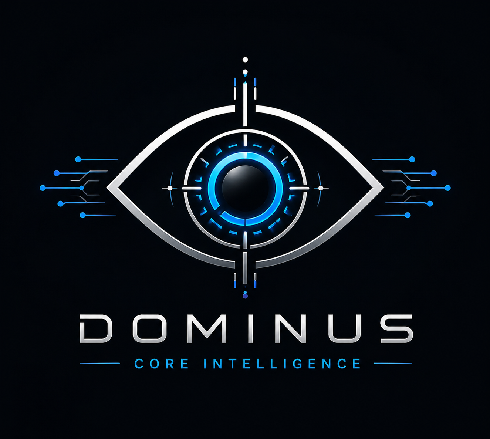

  

# Dominus

**Dominus est une IA personnelle qui contrôle et vérifie ce qu'une IA fait avant qu'elle agisse.**

> *La plupart des systèmes d'IA se concentrent sur ce que l'IA peut faire.*
> *Dominus se concentre sur ce que l'IA devrait être autorisée à faire.*

Projet personnel en développement actif. Tourne en local, sans dépendance cloud.

> **Statut : développement actif. Pas de release publique stable.**
> Ce dépôt est une vitrine du projet, pas une distribution installable.

---

## Honnêteté sur la fabrication

Je viens du BTP, 18 ans de chantier, et je suis en reconversion vers le
développement Python.

**Je n'écris pas le code moi-même.** Je dirige des assistants IA qui
rédigent, et je joue trois rôles :

- **Architecte** — je définis la structure
- **Garde-fou** — je fixe les règles et les limites
- **Relecteur** — je teste, je casse, je valide

Chaque décision passe par une validation manuelle. C'est cohérent avec
l'idée même de Dominus : une IA qui n'agit qu'avec consentement.

---

## Ce que Dominus fait aujourd'hui

- Analyse les actions effectuées sur le système
- Garde une trace structurée de ce qui se passe (logs + mémoire)
- Donne un avis avant chaque modification (sûr / prudence / à éviter)
- Fonctionne sans dépendre d'un service externe
- Chaque instance reste personnelle, mais peut échanger des évolutions
  validées avec d'autres instances de confiance, sans serveur central

---

## Ce que Dominus n'est PAS

- Pas un produit
- Pas une version finale
- Pas un système autonome
- Pas du code écrit en solitaire (cf. section "Honnêteté sur la fabrication")

---

## Phase actuelle

| Phase | Description | Statut |
|---|---|---|
| **Phase 5** | Avis avant chaque modification (sûr / prudence / à éviter), non bloquant | Active |
| **Phase 6 — Shadow** | Observation en lecture seule, rapport quotidien | En test |
| Phases suivantes | Documentées, non activées | En attente |

Aucune phase ne s'active sans validation explicite.

---

## Documentation

- [ARCHITECTURE.md](ARCHITECTURE.md) — vision et principes
- [ROADMAP.md](ROADMAP.md) — phases et trajectoire
- [SECURITY.md](SECURITY.md) — invariants de supervision

---

## Auteur

Eddy Gaudin — projet personnel, mono-mainteneur.

---

*Dépôt vitrine. Le code source de l'implémentation n'est pas inclus ici.
Voir [LICENSE](LICENSE) pour les termes d'utilisation.*
